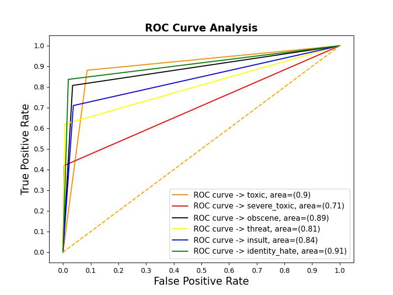

# Toxic Comment Classification

### **Description:**

Detect toxic or hate speech in Tweets by millions of users. 
Discussing things you care about can be difficult. The threat of abuse and harassment online means that many people stop expressing themselves and give up on seeking different opinions. Platforms struggle to effectively facilitate conversations, leading many communities to limit or completely shut down user comments.

## **Approach**

- This is a Multi-Label Classification problem, It originated from the investigation of text categorisation problem, where each document may belong to several predefined topics simultaneously.

- Highly Imbalanced Dataset, most of the comments were Neutral

- High degree of Correlation among Toxic, Severe Toxic, Obscene and Insult Categories

- For a highly imbalanced dataset, Oversampling techniques like SMOTE can be applied for Multi-Class Classification. Similarly, for Multi-Label problem MLSMOTE (Multi Label SMOTE) technique can be applied to up-sample minority class records. But the high dimensional nature of the numerical vectors created from text can sometimes make other forms of data augmentation techniques more appealing.

- **Data Augmentation with Paraphrase Generation:** I used Google's T5 pretrained model to generated paraphrases for minority class labels such as Identity Hate, Severe Toxic and Threat categories. 

- **Data Cleaning:** Removed Emojis, links, stopwords, whitespaces, newline characters, repeated words, expanded contractions and normalized text data with lemmatization. This step is crucial in removing irrelevant text and give more importance to less frequent words to help model distinguish among each category

- **Model Training:** Used an LSTM network with Fast Text Embeddings to train the model with Binary Cross Entropy (Log Loss) loss function and AUC as the metric. 

- **Model Evaluation:** Used ROC-AUC curves, Confusion matrix, Micro Average Precision and Micro Average Recall to evaluate the trained model



- **API Creation:** FastAPI was used to create API Endpoints. To detect language of the text, Fast Text's Language Detector Pre-trained model was utilized. 
Implemented Data Validation, Logging and Exception Handling. A threshold of 50% was considered to classify a comment as toxic/non-toxic.
  
- **Version Control** - This whole project is version controlled for Source Code and Data using Github and DVC. Continuous Integration Pipeline has been created using Github Actions and CML (Continuous Machine Learning)
Model Experiments performed can also be viewed in DVC Studio (https://studio.iterative.ai/user/shreyassks/views/toxicity_classfier-qor49yes54)
  


- **Docker Container** - Finally, a docker image has been built and pushed to Docker Hub to launch this project.

## **Steps to Launch and Test the API Endpoints**

- Launch Docker Container: 
  
```sh 
docker run -d -p 80:80 --name khoros-assignment skshreyas714/toxicity-image:v4
```

- Open Browser and enter http://127.0.0.1:80/docs


- This would launch a nice GUI from Swagger for FastAPI as shown above

- To test fake API Endpoint with hardcoded values for mandatory fields follow below command. Alternatively you can use the GUI as well to test it easily
```shell
curl -X 'GET' \
  'http://127.0.0.1/api/toxicity-detection-fake?company=Samsung&comment=Khoros%20is%20awesome&start=2022-01-09T14%3A11%3A13.236458&lang=en' \
  -H 'accept: application/json'
```


- To test the actual API Endpoint, please use below command. 
```shell
curl -X 'GET' \
  'http://127.0.0.1/api/toxicity-detection/Samsung/Khoros%20is%20awesome?start=2022-01-09T14%3A11%3A13.236458' \
  -H 'accept: application/json'
```

